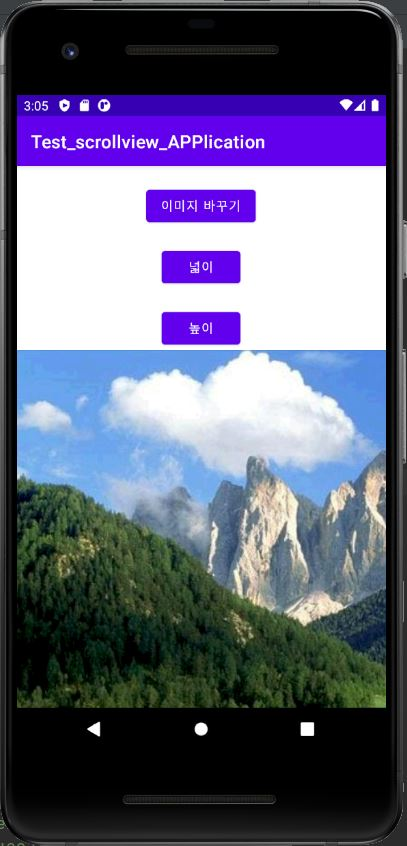
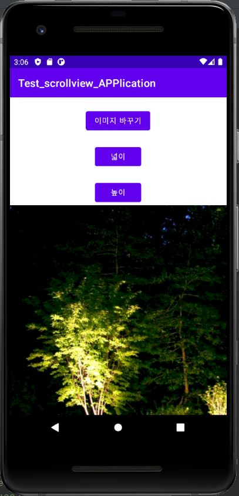

# 2021년 2학기 캡스톤디자인 안드로이드맵 프로그래밍

## 2주차
</img>

## 3주차 과제
</img>
</img>

## 4주차 과제
  - 아이디어명 : 맛집의 불편리한 웨이팅을 해결하고 소비자들의 니즈를 충족시킬 수 있는 & 소비자뿐만 아니라 사장님의 입장에서도 도움이 되는 무료 애플리케이션
  - 아이디어 설명 : 얼마 전 부모님의 결혼기념일이라 초저녁쯤 갈 만한 식당을 알아보던 중 다 웨이팅이 꽉 차고 인터넷상에선 예약이 없다고 해서 간 식당에도 사람이 많아 혼란스러운 경험이 있었다. 그래서 앱 하나로 정확한 가게의 상황을 알 수 있는 애플리케이션이 떠올랐고 또한 시중에 이런 앱들은 이미 좀 개발되어 있기 때문에 차별화를 두고 싶어 사장님들도 쉽게 사용 가능하신 앱을 혼합하여 만들고 싶었다.

## 5주차 과제
</img>
</img>

## 6주차 과제
</img>
</img>
 - 높이 넓이 포함

## 7주차 과제
</img>

## 9주차 과제
</img>

## 10주차 과제
</img>
</img>

## 11주차 과제
</img>
