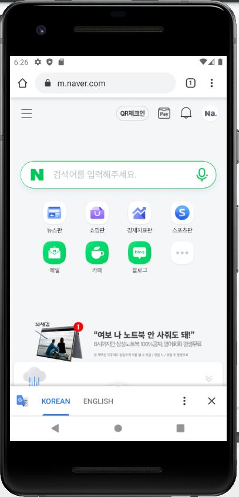
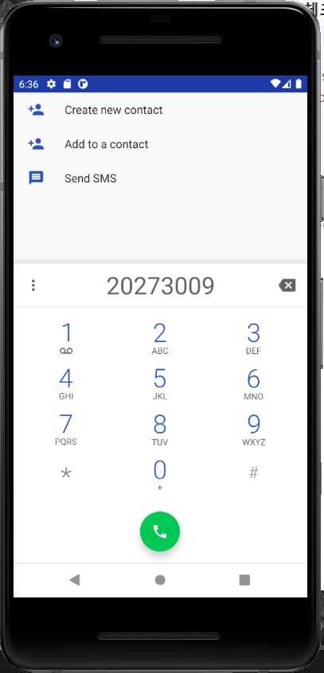
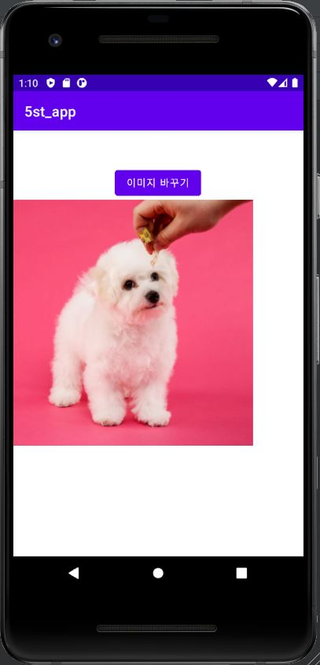
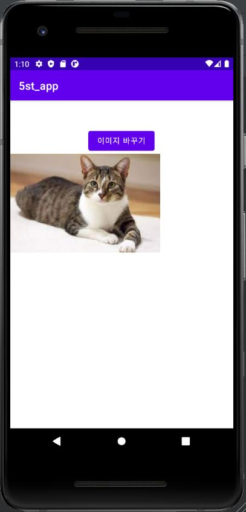

# 2021년 2학기 캡스톤디자인 안드로이드맵 프로그래밍

## 2주차
</img>

## 3주차 과제
</img>
</img>

## 4주차 과제
  - 아이디어명 : 옷, 악세사리등을 오프라인 매장에 안 가도 착용해본거처럼 테스트 할 수 있는 앱 
  - 아이디어 설명 : 옷은 직접 가서 눈으로 보고 만져보고 사는 게 제일 좋지만 코로나19상황인 만큼 밖에를 여유롭게 다닐 수도 없고 온라인 쇼핑몰이 너무나 잘 되어있기 때문에 ( 할인율, 여유로운 재고 수 등) 온라인 쇼핑을 하는 고객들이 대다수이다. 하지만 온라인 쇼핑몰이라도 장점만 있는 건 아니다. 사이즈 오류, 원하는 재질, 핏이 안 나올 수도 있다. 그러하여 모바일에서 자신의 얼굴과 헤어스타일, 체형을 설정하여 맘에 드는 옷을 직접 대보며 잘 어울리는지, 핏은 어떤지, 옷들의 조합은 다채로운지 미리 확인하고 구매할 수 있다. 이러하면 확실히 온라인 쇼핑몰의 반품률도 줄고 소비자 입장에서도 원활한 쇼핑을 할 수 있을 것 같다!

## 5주차 과제
</img>
</img>
